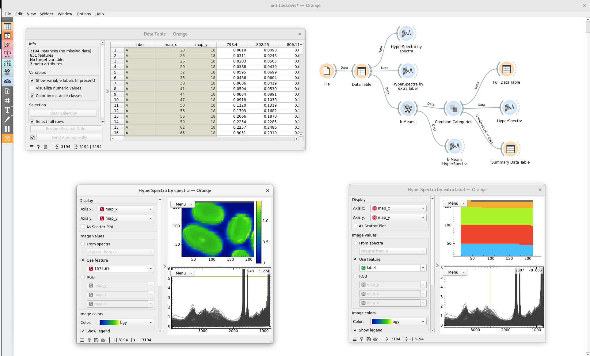
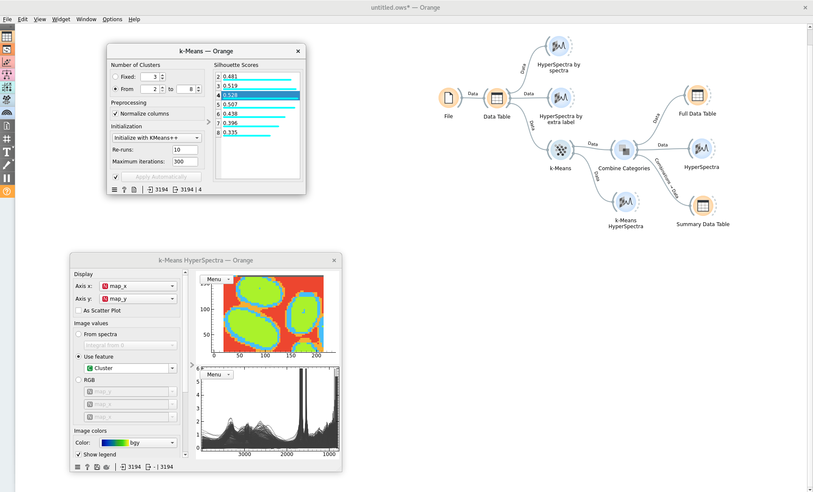
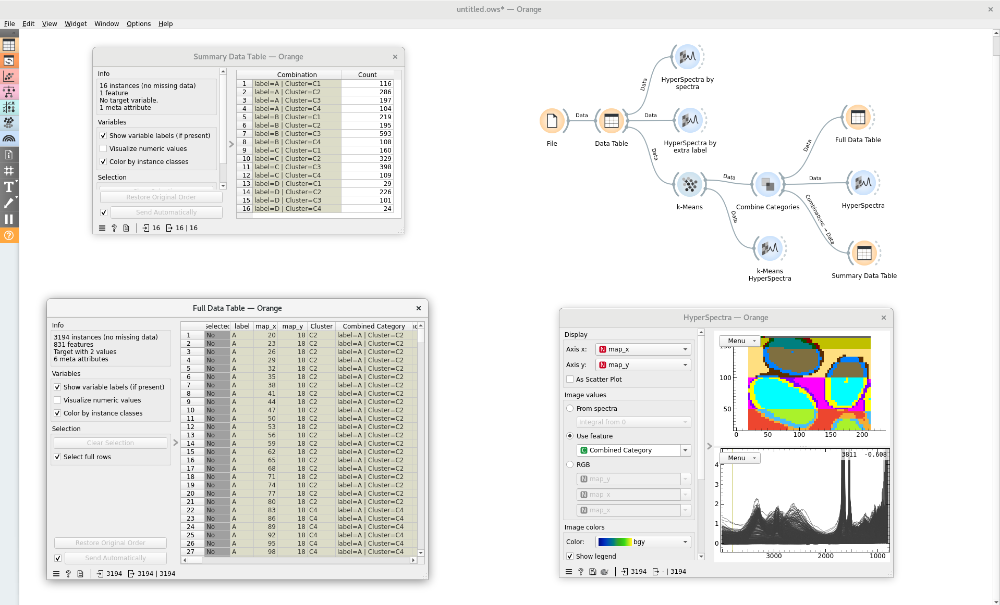

# Combine Categories

The Combine Categories widget creates a new categorical variable that represents each unique combination of values from one or more selected categorical variables.

It is useful when several classifications describe different aspects of the same observations and a single combined classification is needed. For example, a clustering result can be combined with a sample-region classification so that each distinct cluster-and-region pair becomes a separate category.

**Inputs**

- Data: Orange data Table
    * The table may contain attributes, class variables and meta variables.
    * At least one discrete variable is required to generate a combined category.
    * If the input contains no discrete variables, the widget displays a warning and cannot generate a combined category.

**Outputs**

- Data: Orange data Table

    * **Added variable:** A variable of name `Combined Category` is appended to the meta variables.
    * Each input row receives the code of its unique combination of selected discrete values.

- Combinations: Orange data Table
    * A summary table containing one row for every unique generated combination.
    * One row entry per unique combination of selected values.

**Example**

This example uses a slightly modified version of the Hair Section dataset obtained by the Datasets widget. The data was given an extra meta column called
"label", which arbitrarily ran across the dataset in 4 different labels: A, B, C, D.

Figure 1 shows how the modified dataset can be plotted in two ways with the HyperSpectra widget, along with the raw data table. In the widget on the left (window titled "Hyperspectra by spectra") the data are coloured by a particular wavenumber, while on the right ("HyperSpectra by extra label"), the labels A-D are plotted spatially instead.

We next use the k-Means widget to cluster the spectral data, shown in Figure 2, along with another HyperSpectra widget plot, showing how the data have been clustered according to the shape of the spectra at each location.

With two separate labels, we can now use our Combine Categories widget, as shown in Figure 3. The widget generates two outputs, which we can view in separate data tables. 

The data table in the top left shows a summary of how the two meta attributes have been combined. The "Combinations" output of the widget contains a table with a single meta attribute, combining the label we made for this example with the location.

The combination is shown for each spatial entry in the data table in the Full Data Table window on the bottom left. The same Combination label is now inserted for every entry. Moreover, we can also plot this, as shown on the bottom right HyperSpectra window. Now, each Combined Category is coloured differently.

From here, selection tools could be used to further isolate particular regions of the data, depending on what is of interest.

While this example is not of significant practical use with its arbitrary labelling, it is intended to illustrate how meta attributes of a dataset may be combined using this widget.
