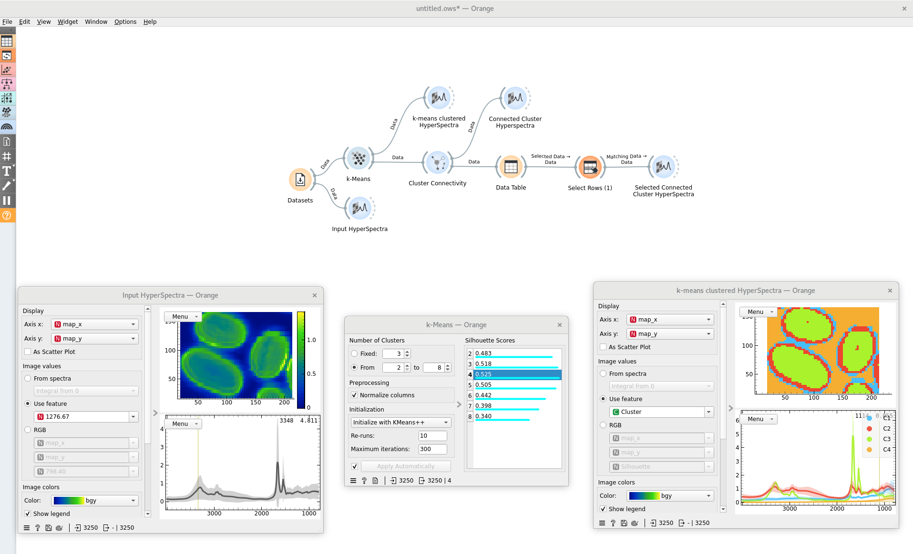
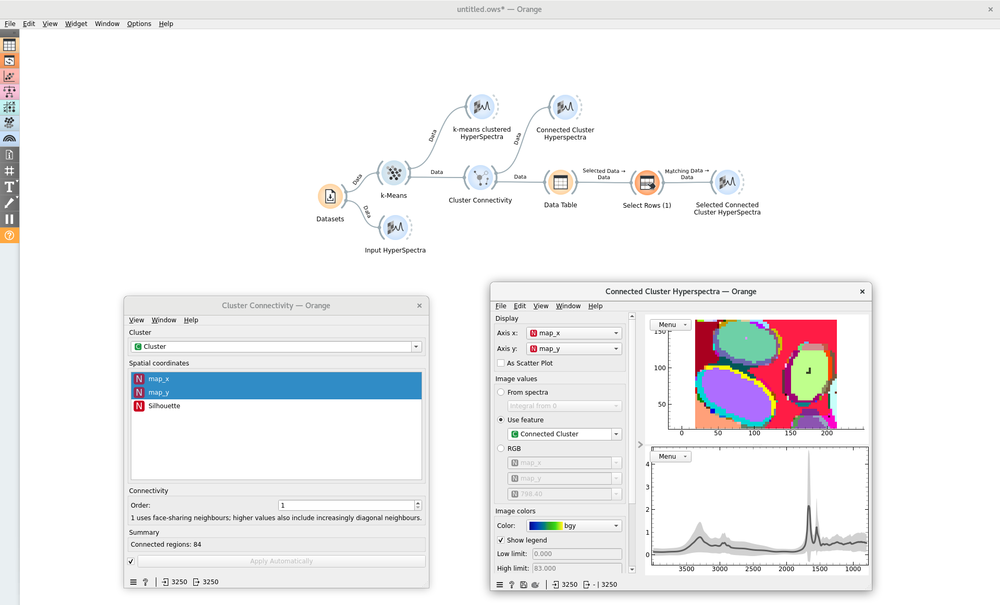
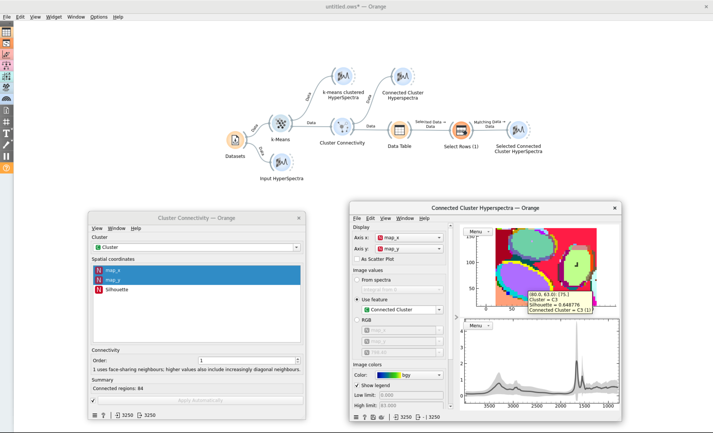
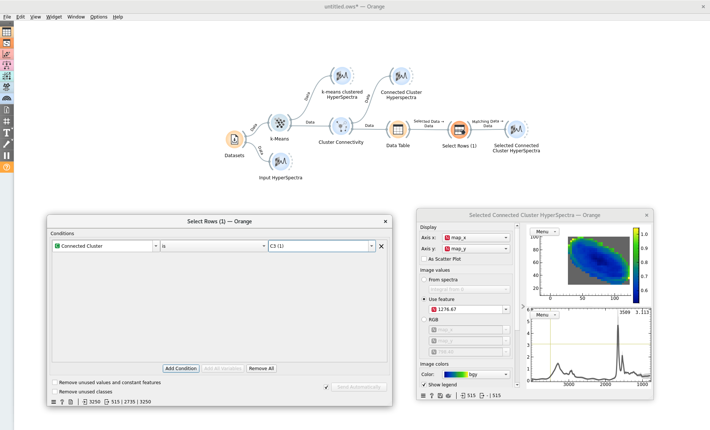

# Cluster Connectivity

The Cluster Connectivity widget identifies spatially contiguous clusters from hyperspectral data and assigns new category labels to them.

Multiple regions of a hyperspectral image may be identified as belonging to the same cluster by their spectral signal. The Connected Clusters widget applies a spatial clustering of the data on top of the signal based clustering, to further break down an image by region.

**Inputs**

- Data: Orange data Table

**Outputs**

- Data: Orange data Table

    * **Added variable:** A variable of name `Connected Cluster` is appended to the meta variables. The variable combines the original clustering label with a new unique spatial region identifier

**Example**

This example users the Hair Section dataset from the Datasets widget.

To begin, we perform a simple clustering of the data by the spectral signal using the k-Means widget. Figure 1 shows how the data are partitioned into four clusters by their signals.

Visually, we can see that the signal-based clustering has divided the image into regions that are outside, around the interface, and inside the hair segments present in the image. The aim of the Cluster Connectivity widget is then to further divide the clusters by spatial region, so that we can only take one cluster forward for further analysis. 

Figure 2 shows the output of the widget in another HyperSpectra widget image. Where before the interiors of each of the hair segments were part of a single cluster, the Cluster Connectivity widget has identified that they are not all contiguous regions and so further separated them. We can hover over the image as in Figure 3 to see that the largest interior segment has a `Connected Cluster` meta attribute of `C3 (1)`, indicating that it is the largest spatial cluster in the signalling cluster C3.

Identifying this cluster allows us to then select it out for further analysis using the Select Rows widget in Figure 4. The selection can then be fed to another HyperSpectra widget, showing us only the interior of this large hair cross section.

