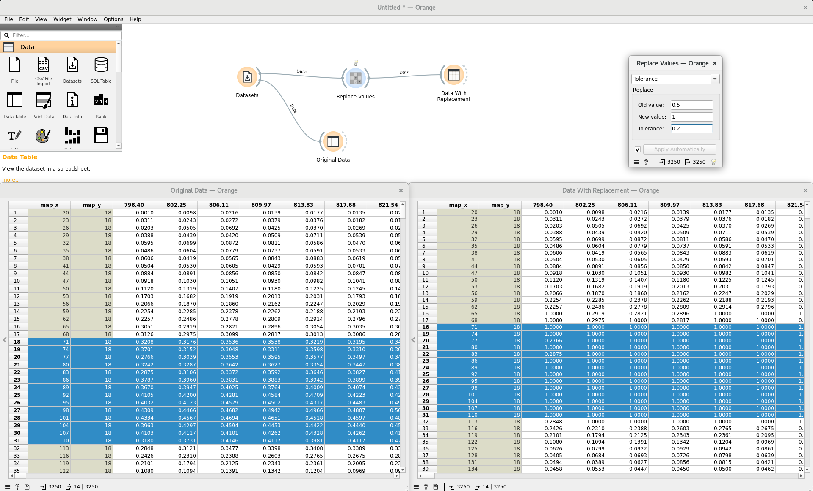
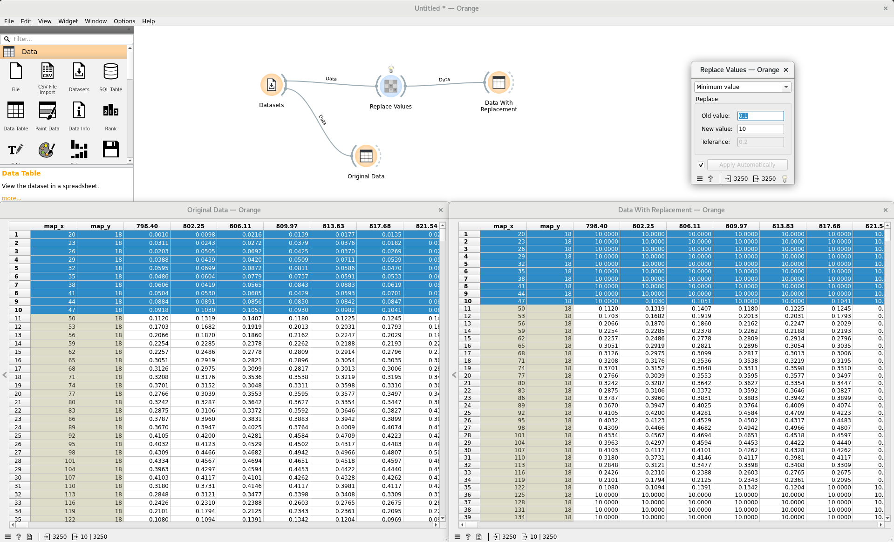
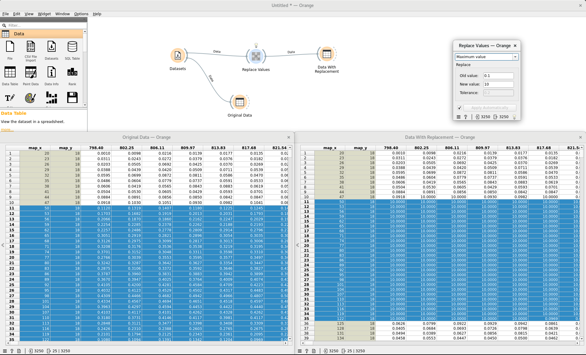

Replace Values
===============

Replace values of spectra based on input threshold.

WARNING: Take care using this widget if the order of elements in the input data have been changed.

**Inputs**

 - Data: Input data set

**Outputs**

 - Data: Input data set with modified values where applicable

Tolerance replacement
-------------------------

Using *Tolerance replacement*, the `new value` replaces any entry in the data table where the condition `old value ± tolerance` is met.

Minimum value replacement
-------------------------

Using *minimum value* replacement, the `new value` replaces any entry in the 
input data table less than `old value`.

Maximum value replacement
-------------------------

Using *maximum value* replacement, the `new value` replaces any entry in the 
input data table greater than `old value`.

