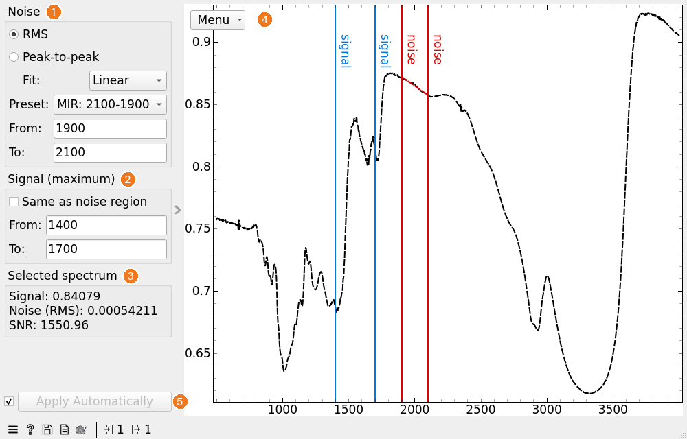

SNR (Region)
============

Calculate the signal-to-noise ratio (SNR) of each spectrum from selected spectral regions.

**Inputs**

- Data: input dataset

**Outputs**

- Data: input dataset with *Signal*, *Noise* and *SNR* appended as meta attributes

The **SNR (Region)** widget estimates the noise of each spectrum within a *noise region*, takes the signal as the maximum band value within a *signal region*, and computes

*SNR = \\(\frac{signal}{noise}\\)*

Both regions are selected interactively on the plot or by typing their limits. Noise can be computed as an RMS deviation from a fitted baseline or as a peak-to-peak value.

1. **Noise**: how the noise is computed, and where.
   - *RMS*: the spectrum within the noise region is fitted with a *Linear* or *Quadratic* polynomial (choose with *Fit*), and the noise is the root mean square of the residuals:

     *RMS = \\(\sqrt{\frac{1}{n}\sum_{i=1}^{n}(y_i - y_{i,fit})^2}\\)*

     where \\(n\\) is the number of points in the region. Fitting removes a sloping or curved baseline, so that only the noise contributes to the result.
   - *Peak-to-peak*: the noise is the difference between the maximal and the minimal band value within the noise region.
   - *Preset*: set the noise region to a standard range: FIR (320–280), MIR (2100–1900) or NIR (5500–4500). The preset switches to *Custom* when the region is changed by hand.
   - *From* / *To*: limits of the noise region. They can also be set by dragging the red *noise* lines on the plot.
2. **Signal (maximum)**: the signal is the maximal band value within the signal region.
   - *Same as noise region*: use the noise region for the signal too. The signal region controls and lines are then disabled.
   - *From* / *To*: limits of the signal region. They can also be set by dragging the blue *signal* lines on the plot.
3. **Selected spectrum**: signal, noise and SNR of the spectrum selected on the plot. The values update while the region lines are dragged.
4. Plot of the input spectra, with its menu as in the [Spectra](spectra.md) widget. Click a spectrum to select it. For the selected spectrum, the plot shows the fitted baseline in the noise region (dashed red line; *RMS*), or the minimal and maximal values in the noise region (two dashed red lines; *Peak-to-peak*).
5. If *Apply Automatically* is checked, changes are sent to the output automatically. Otherwise, press *Apply*.

When new data arrives, region limits that fall outside its spectral range are reset: the noise region to the first tenth of the spectrum and the signal region to the whole spectrum.

The widget shows a warning if a region contains no data points, or if the noise region has too few points for the selected fit (at least 2 for *Linear* and 3 for *Quadratic*). Spectra for which a value cannot be computed get a missing value.

Unlike the [SNR](snr.md) widget, which computes statistics of each wavenumber across a group of spectra, **SNR (Region)** gives one SNR value for every spectrum.
